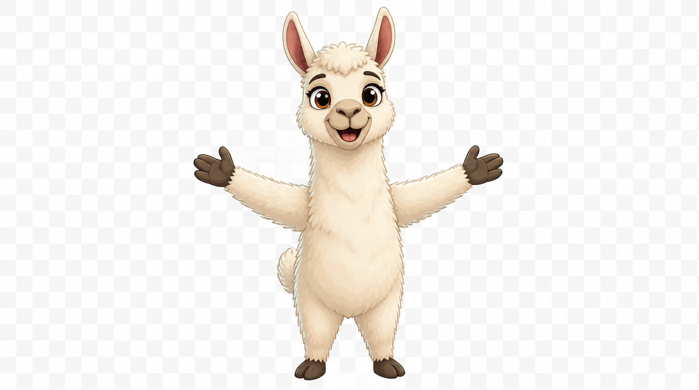

# Llama Hugs 🦙

A fork of [llama-swap](https://github.com/mostlygeek/llama-swap) (pinned at
v250) that will eventually replace it as the model router on the wimpy
inference host. The MVP runs as a parallel router on its own port/config/store,
reading the same GGUF model files llama-swap already uses.

## Status

Planning + early fork setup. See [`full-plan.md`](full-plan.md) for the
implementation plan and phase tracking.

- **F0 (fork setup):** complete — fork cloned @v250, Go toolchain installed,
  build reproduced, router runtime proven locally.
- **F1 (MVP parallel run):** next — deploy to a new port on wimpy alongside the
  live llama-swap without modifying it.

## Layout

- `full-plan.md` — the plan.
- `llama-hugs.md` — the original overview/context document.
- `hugs/` — the actual fork source (gitignored here; tracked in its own clone).
- `llama-hugs-mascot.png` — project mascot.

## Hard rules

Llama Hugs must never modify the running llama-swap during the build: own port
(8181), own config/store/install dirs, own binary name. Cutover = repoint
clients; decommission of llama-swap is a separate future approval.
